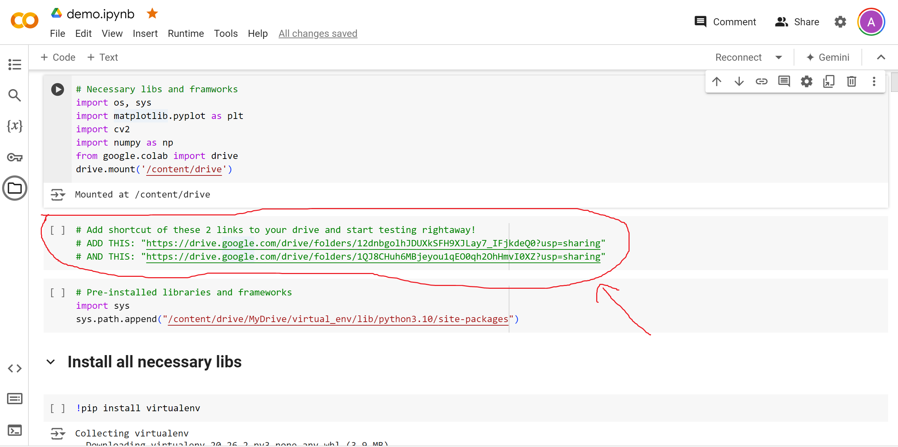
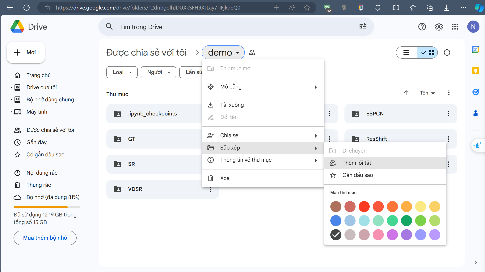
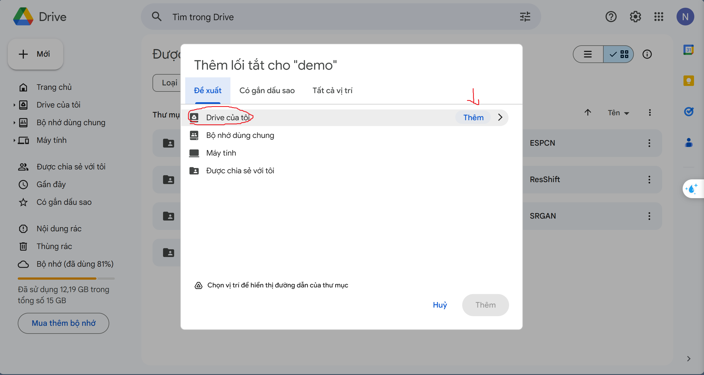
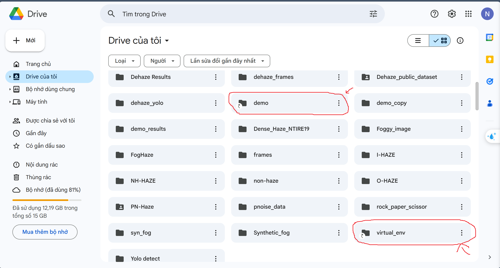
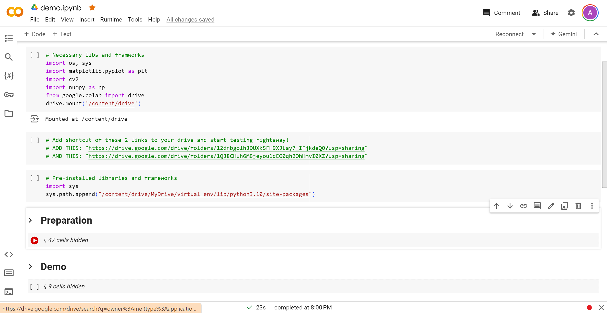
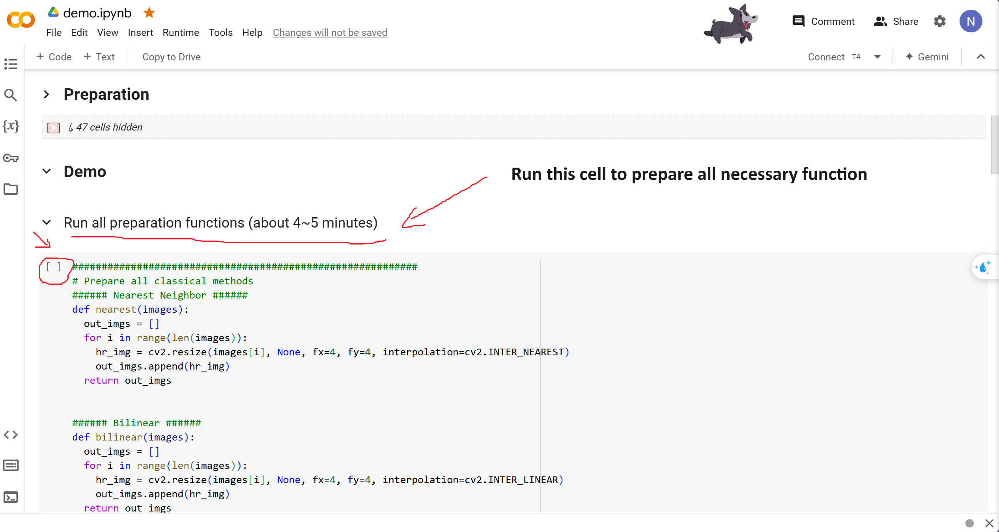
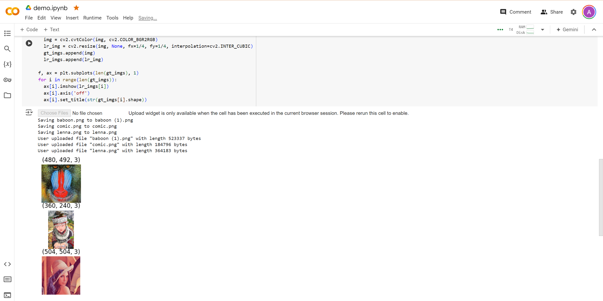
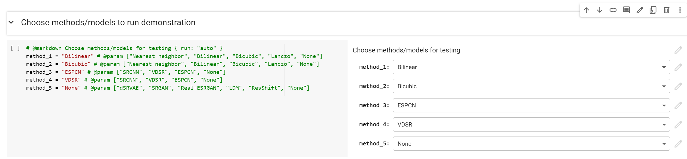
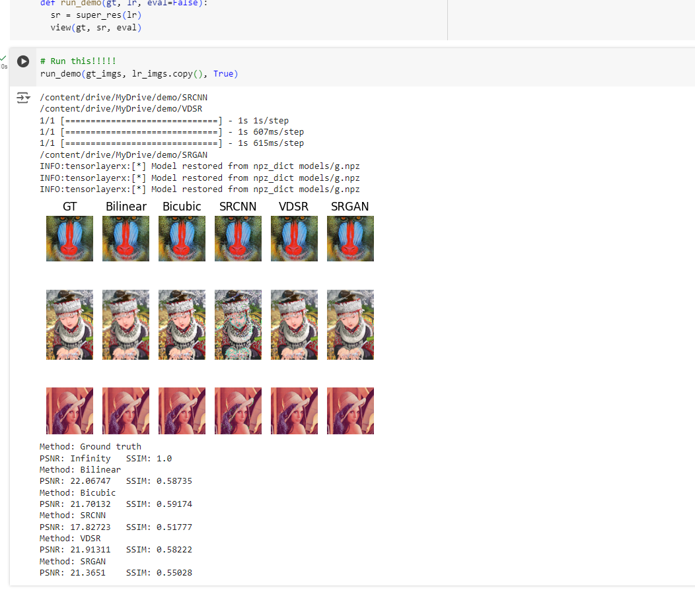

# **Single Image Super-Resolution**
## Group 3
### Group information:

| Student ID | Full Name        |
| ---------- | ---------------- |
| 20210272   | Nguyễn Đăng Duy  |
| 20210466   | Hoàng Văn Khang  |
| 20215254   | Bùi Đức Việt     |

## Report and slides
Please see inside this given folder:
- **Powerpoint slide:** presentation.pptx
- **Report(pdf):** Single_Image_Super_Resolution.pdf

## Contributed dataset
In this project, we also contributed a new synthetic dataset for SISR problem. The dataset contains 2 folders:
- HR_images inculdes 1,200 high-resolution images as label for training
- LR_images includes 3 sub-folders: 
    - bicubic-4x contains low-resolution images created using bicubic interpolation (Most common degradation method)
    - bicubic_blur-4x contains low-resolution images created using bicubic interpolation with the addition of a blur kernel to reduce the sharpness of images
    - bicubic_noise-4x contains low-resolution images created using bicubic interpolation with the addition of white Gaussian noise act as a more challenging dataset for training or testing

You can access the dataset in https://drive.google.com/drive/folders/1F8yqKz7XTFcH4q_6TfaypkTqf05RsyNE?usp=sharing. More details about this dataset can be found in the report.

## Demo
For the demo, you will uploaded one or many images for experiment, these serve as the high-resolution images(Ground truth). Each image is then be resized be a scale of 4 (smaller than the original uploaded one by 4 times), which serve as the low-resolution image.

These resized images will then go through the pipeline of the methods you select and output the super-resolution of scale 4. After that, PSNR and SSIM are calculated for each methods for comparison.

You can access the demo file via this https://colab.research.google.com/drive/1pwxR-zbi_ziiQDuabA9_YnUCJ7Uoxl7-?usp=sharing.

**Please see the below installing requirement without installing all the library to be able to run the demo file.**

### Running colab demo without the need of installing library
Since the amount of library are very large and require a lot of time to set up, we have provide a way for you to run these colab implementation notebook without installing any library or models resourse. 

Just follow these step and you can start running rightaway:

**Step 1:** Add the share drive link to your local drive:
    When open the colab demo file, you may seen a cell (2nd cell at the begining) that contains the drive links.
    
    These links are links contained the necessary libs and models file that you need to run the demo file. 
    
**Step 2:** Add the shortcut to your local drive. All you need to do is **Open these links and add a shortcut to your local drive**
    
    Then **MAKE SURE you add it into you MyDrive folder**
    
    
**Step 3:** Check if they are added successfully
    When those folder shortcut are successfully added to your MyDrive, in your MyDrive folder should contains these 2 folders as shown here:
    
    Now you can run the notebook without installing any libs

> [!WARNING]
> You could download those 2 folders to your local machine to run, however, we **DO NOT SUGGEST** you to do so, as both of them are over 8Gb of data (If you install it locally, please add all libs in *virtual_env* to your local python interpreter).

### Start running demo 
- In the demo file, you **ONLY** need to run the first 3 cells and the **Demo** section, the **Preparation** section it only for testing different images for uploaded drive images.

- Inside the demo section, first you will need to run the *Run all preparation function* cell to initialize all need models (It would normally take about 4~5 minutes, maybe longer if your internet connection is bad)

- Then run the *Upload experiment images* to upload images for testing. You can choose as many images as you want. After click on the upload button, all chosen images will be uploaded to drive and ready for next step

- Now you will need to select the methods you want to use (Note that *ldm* and *ResShift* are the 2 diffusion models that are not available for the current time, so please do not choose them!). After you select the need methods, click the run button of this cell.

- Finnaly, run the last 2 cells and the super-resolution images will be generated as well as the metric evaluation at the end of the output cell.

## Source code
We analyze the problem of Single Image Super-Resolution (SISR) with 3 different approaches:
- 1. Classical approach: Image processing
- 2. Deep Learning approach: CNNs
- 3. Modern approach: Generative model
     
**All details analysis and training implementation can be found in the report!!!**

> [!IMPORTANT]
> **Please note that all of the code we show in this zip file are implemented in Google Colab, so we _STRONGLY_ suggest that you use the colab links below for better experiment without the need of install a large amount of library, framework and data needed for the implementation (may about 8Gb of data and take a large amount of time and effort to setup)**

### Classical methods - Image processing
- Implementation: Please see in *Source code/Classical/Image_Processing.ipynb*
- **Colab:** [Image processing](https://colab.research.google.com/drive/1H-nwYogCMbNOUc_9gZeuDSIn1N80CZXz?usp=sharing&fbclid=IwZXh0bgNhZW0CMTAAAR3nHwLsXaLj-D4fXTl12ha5f2ZI95Zr61k3wia5SHeMuFonrLIp34UuQI0_aem_ASV4ApBFi0bVaKoc9onfRMpxa11chVX1SPii8tF1odshOsd6qwa7d__4TpGcMxXuv7kwxJzX4xSOTarSQQmzRqe4#scrollTo=m6UhUsLR_9ZS)
- 3 methods were experimented and analyze:
    1. Nearest Neighbor
    2. Bilinear interpolation
    3. Bicubic interpolation
       
*(Extra: Lacnzo have also been experiment but we have not fully understand the idea of it so its not include in the report, however, you can still play with it in the colab file :grinning:)*

### Deep learning methods - CNNs
- Implementation: Please see in *Source code/CNNs*
- 3 models were experimented and analyze:
    1. SRCNN [colab]() (source code can be accessed in *Source code/CNNs/SRCNN*)
    2. ESPCN [colab]() (source code can be accessed in *Source code/CNNs/ESPCN*)
    3. VDSR [kaggle](https://www.kaggle.com/code/oneplusoneisthree/vdsr-v2) (source code can be accessed in *Source code/CNNs/VDSR*)

### Generative models
- Implementation: Since training a generative model would need lots of computation resources and a good enough GPU, which its impossible for us to access(*Colab and Kaggle GPU doesn't satisfied the training requirement*) so we use the pretrained models to analyze and evaluate. We have modify the inference code for personal usage and implementation.
  
> [!NOTE]
> We do not include the source code for these class of model since they are very large (as well as their saved pre-trained weights) and hard for us to explain the pipeline to inference with these models so we have included all inference scripts inside the demo colab file(See above).

- 3 models were experimented and analyze:
    1. dSRVAE
    2. SRGAN
    3. Real-ESRGAN

